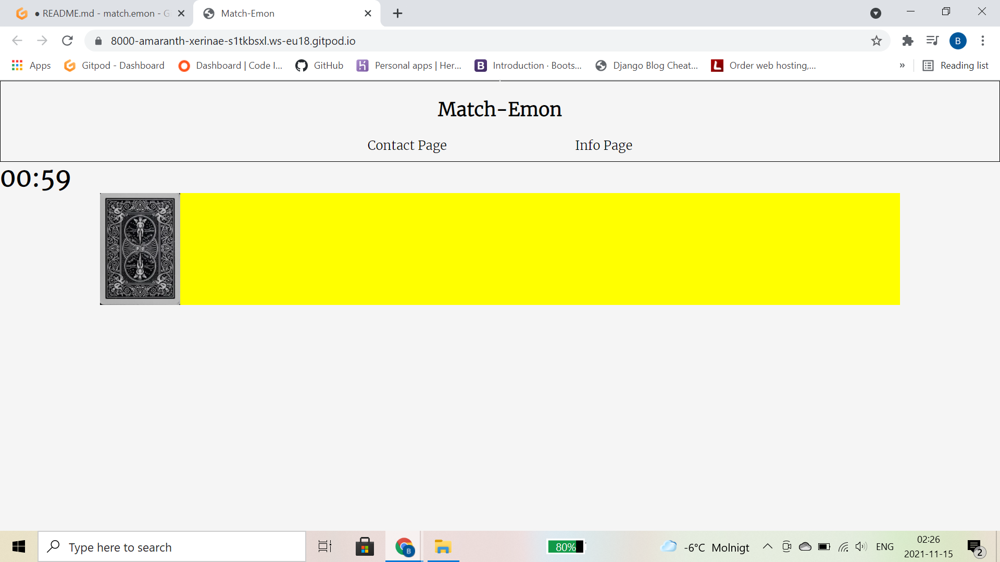
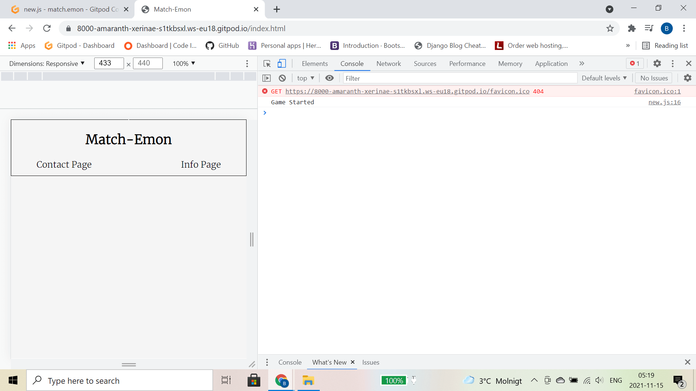
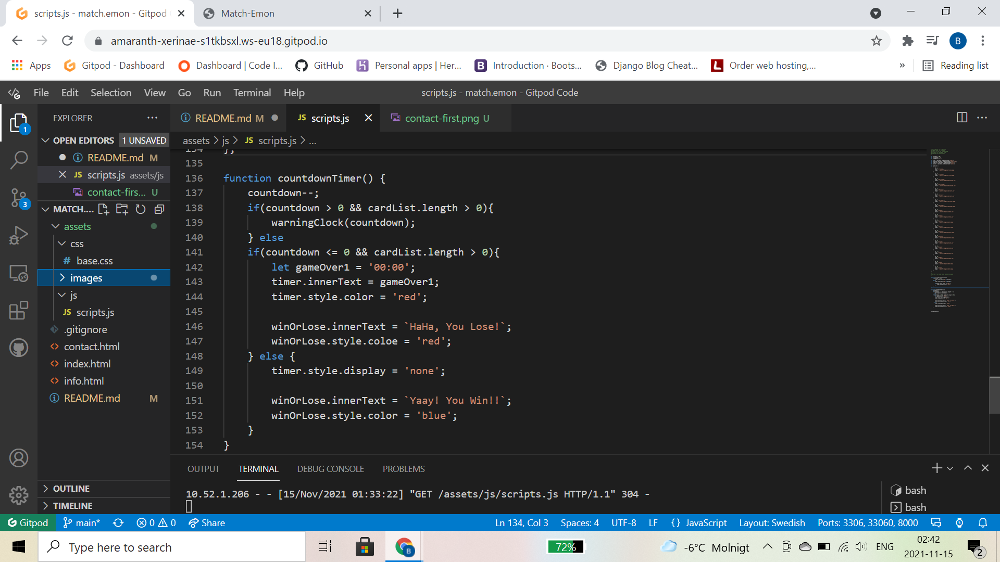
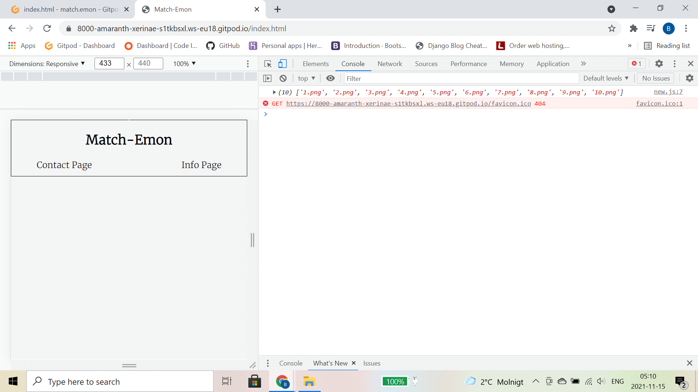
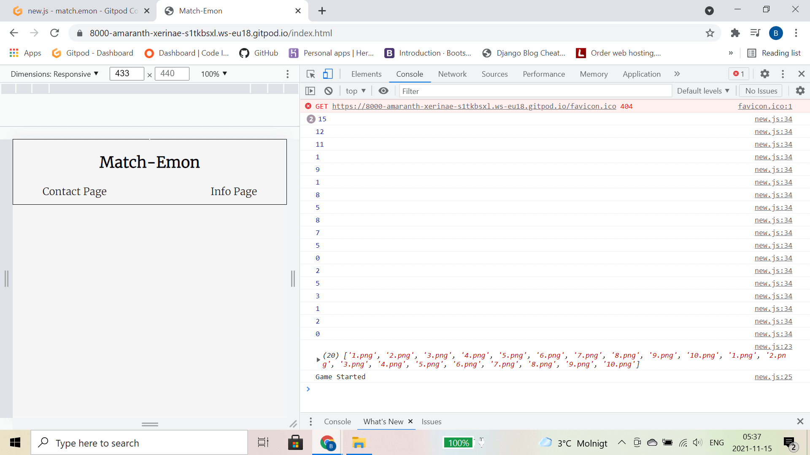

# [Match-Emon]()

## Table Of Contents

1. [Overview](#overview)
2. [Links](#links)
3. [TheBuild](#build)
4. [Wireframes](#wireframes)
5. [Functionality](#functionality)
6. [Styles](#styles)
7. [Sources](#sources)
8. [Issues](#issues)

# Overview
Match-Emon is a card matching game. It consists of a timer, a move counter and a play grid. When the user starts the game, a clock will countdown from 60, the user has 60 seconds to find all the pairs in the play grid, if they do then they will be met with a win message. If they don't succeed then they will see a lose message. I added a move counter as I feel it adds a little pressure and it gives the user the ability to try to better their score over time.  
I created this website using three languages:  
[HTML5](https://sv.wikipedia.org/wiki/HTML5) | [CSS](https://sv.wikipedia.org/wiki/CSS) | [Javascript](https://sv.wikipedia.org/wiki/Javascript)  
These languages work well together and have enabled me to create what I think it a fun and interactive game/website. I chose to make a pairs game as I feel it's a good way to show my knowledge on the three languages whilst also challenging myself. For this project I decided to build a little differently from how I have built in the past, I took a more agile approach to creating this website. This meant that instead of looking at the project as a whole. I broke it down into more managable increments, this allowed me to make sure that what I had written was 100% functional before moving on to the next item.

# Links
[Link To Match-Emon]()  
[HTML Checker]()  
[CSS Checker]()  
[JSHint]()  
Above are links to my website and links to pages that have checked my code for any possible errors or issues, the results for each check are in the links.

# The Build
This was a fun project to build and I decided to break it down into sections to show you how I did things.  
To begin I created all the files and folders I needed and added any images. Then I connected up all files and checked to make sure everything was linked up successfully.  
Then I created the base for the website, including basic html and css. Just to have the items I would need visible. This helped as it gave me a visual of how things were shaping up.  
   
 The website if broken up into three pages:  
 Homepage (Match-Emon) |  Contact Page | Info Page  
 By having a contact page, I am able to receive feedback from users. This allows me to listen to user wants/needs whilst also letting people reach out to me if they find a problem or have any ideas on how to improve the site. Below is an image of my first draft of the contact page. Although it's basic, it is functional, and my priorities with coding are always functionality first, looks second!  
   

 # Wireframes
Creating wireframes is a very important step as is helps me to create a visual representation of where I am aiming to go. This allows me to stay focused on the task ahead and not get sidetracked on the smaller things.  

# Functionality
This is my first official project where my main focus is JavaScript. It has been a challenge but, I enjoyed the experience. Initially I did not know where to start. So I decided to focus on the timer function as it seemed fairly simple and the rest of the game would work around it. 
    Image of timer function">  
Once I had added the images to the scripts.js file, I felt I should make sure they show up, so I called the images to show in the console.  
   
 Then I added a shuffle function to randomly shuffle the images(playing cards) when click here to play button is clicked. I had it show in the terminal to make sure it was working correclty.  
   
 Then I created a board function and added the rear card image to each playing card and printed them to the board.  
 

 
# Styles

# Sources
There were a fair few websites that I used during the creating of this website they are as follows:  
[freepngimg](https://www.freepngimg.com/)  
[Wikipedia](https://www.wikipedia.org/)  
[Balsamiq](https://balsamiq.com/)  
[Slack Overflow](https://stackoverflow.com/)
[JSHint](https://jshint.com/)
# Issues

