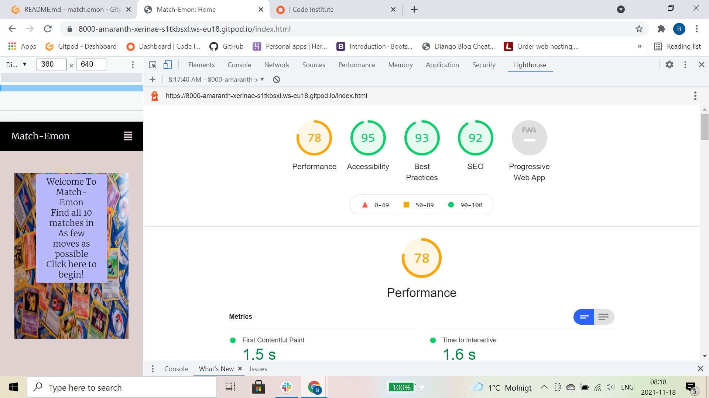

# [Match-Emon](https://benjamin-joe.github.io/match.emon/)

 

## Table Of Contents

1. [Overview](#overview)
2. [Links](#links)
3. [Build](#build)
4. [Responsive](#Responsive)
5. [Functionality](#functionality)
6. [Styles](#styles)
7. [Sources](#sources)
8. [Issues](#issues)
9. [Deployment](#deployment)

# Overview
I decided to create a matching game for project 2 with Code Institute. I creates this game focusing it around javascript. The concept of the game is very simple. Players must find all 10 pokemon character matches in the fewest moves possible. There are 20 playing cards in total so the best possible score is 20, although that is very unlikely :)   Given that moves are being counted as you play it encourages replayability as you have a chance at bettering your score.I believe that this website shows that I am able to use javascript, html and css together with a fairly good end result.   
The thing I am most proud of with this website is it's mobile view, I believe that the website looks even better on mobile than on PC !
I created this website using three languages:  
[HTML5](https://sv.wikipedia.org/wiki/HTML5) | [CSS](https://sv.wikipedia.org/wiki/CSS) | [Javascript](https://sv.wikipedia.org/wiki/Javascript)  

# Links
[Link To Match-Emon](https://benjamin-joe.github.io/match.emon/)  
[HTML Checker](https://validator.w3.org/nu/?doc=https%3A%2F%2F8000-amaranth-xerinae-s1tkbsxl.ws-eu18.gitpod.io%2F)  
[CSS Checker](https://jigsaw.w3.org/css-validator/validator?uri=https%3A%2F%2F8000-amaranth-xerinae-s1tkbsxl.ws-eu18.gitpod.io%2F&profile=css3svg&usermedium=all&warning=1&vextwarning=&lang=en#warnings)  
[JSHint](https://jshint.com/)  
[Responsinator](https://www.responsinator.com/?url=https%3A%2F%2F8000-amaranth-xerinae-s1tkbsxl.ws-eu18.gitpod.io%2Findex.html)  
Above are links to my website and links to pages that have checked my code for any possible errors or issues, the results for each check are in the links.

# Build
The build was a challenge as I wasn't very confident with javascript and although the game is not without flaws i believe that it is pretty good for a novice such as myself.   I went in several different directions during the build process, so there are several fairly large changes from the initial idea to the final line.   To begin with I created a start button and used javascript to get it functional, I felt it was the best place to start  
  
It took me a while to get used to writing javascript so I decided to take it very slow and try to log everything as I went along in the console just to keep me on track. I then created several tests as I went along for various aspects of the foundation of the project.   
Tests I created along the way are as follows:  
Checking Images exist in the console  
  
Start game check  
  
First look at the initial gameboard  
  
Adding a randomize function to randomly place the playing cards  
  
  
Cards turning over ability  
  
Cards to stay turned over if they match  
  

 # Responsive
Responsiveness is something that I struggle with a little bit as I find it a little overwhelming, the sheer quantity of screen sizes. So I followed [Responsinator](https://www.responsinator.com/) as I find their website very user friendly. I believe that the game works well across most devices, there are a couple of device sizes that have an uneven amount of cards in the last row, but apart from that I don't believe there are any major problems with how responsive the website is, and any issues that are there don't seem to get in the way of the gameplay.  

# Functionality
The functionality was by far the most difficult thing about this project. There was a lot of writing and re writing, but overall I am fairly pleased with how it turned out. The specific thing that I found most difficult was actually my own coding! It wasn't until I started bug fixing the game that I noticed I couldn't understand a lot of my own code! This was due to poor naming of functions. So with a little guidance from my mentor I was able to refactor the code and make it waaaaay more readable than it was. So it tought me a very important lesson.  ALWAYS WRITE CLEAR CODE :)  
The one thing I was a little disappointed in was that I wasn't able to add a countdown function to the game to add some pressure to the users. Although I initially wrote a timer into the game, I decided to remove it as I was having a hard time with the game functionality and decided it was best to lose a small function and instead focus on getting the game as a whole working as best as I could  
Here is an image of a lighthouse check I ran on the project, The score was originally only 65 for performance, but I managed to get it up by reducing the size of the background image. I could have reduced it further, but then I felt I was sacrificing the quality of the image  

 
# Styles
Choosing a style for the website proved tricky as i'm quite indecisive on a good day! But I ended up choosing a minimalist view because I didn't want to users to have a sensory overload upon arrival, also slightly due to time constraints.I think that choosing black for the navbar and white for the navbar text really stands out nicely. Also the hover effect creates a subtle enlargment of the links. On smaller screens (below 600px) the navbar will turn into a hamburger icon with the main title still in view, this looks quite sleek and provides good user experience for those on mobile devices. The contact page also stands out subtly with the border effect around the contact form.     
The overall look of the rest of the website looks fairly plain, but with just a tiny amount of color so it doesn't look dull. I will definitely tweak the look of the website as time goes on and I learn more about coding.   

# Sources
There were a fair few websites that I used during the creating of this website they are as follows:  
[freepngimg](https://www.freepngimg.com/)  
[Wikipedia](https://www.wikipedia.org/)  
[Balsamiq](https://balsamiq.com/)  
[Slack Overflow](https://stackoverflow.com/)  
[JSHint](https://jshint.com/)
[w3](https://www.w3schools.com/)  
[Responsinator](https://www.responsinator.com/)  
I also want to give credit to the following for the images used in this project:  
[Alexis Bailey](https://freepngimg.com/author/alexisbai-5859)  
[Lydia Simmons](https://freepngimg.com/author/lydiasimm-7560)  
[Brett Croft](https://freepngimg.com/author/brettcrof-391)  
[Hannah Hill](https://freepngimg.com/author/hannahhil-5479)  

# Issues  
I encountered many issues while making this game, most of them I was able to fix or find a way around, others I received a little help with. Such as an issue preventing matches from staying turned over and the end of game functionality was not working at all. So i decided that those bugs were more important than the one I couldn't get round to. One other thing that I had to cut out were the wireframes as I felt that they was too big of a difference between the wireframes I created at the start of the project and the actual project I ended up with.  There was also an issue with the hamburger icon, when it is pressed it moves down to the bottom right of the screen, I tried to fix it but could not figure out where I went wrong. I will fix it in a later update, but for now I have left it as it doesn't interfere with the gameplay.
I would also like to give a special thanks to my mentor Antonio Rodriguez as has been an incredible help to me and gone above and beyond to help me understand issues and explaining things to me in such a way that make perfect sense. Truly the best mentor!

# Deployment  
Deploying the project was as follows. Go to repo for this project, go to settings, pages, select main and then save, it deployed within minutes, minus an issue where some of the files wouldn't load but that was down to a typing error when linking all the files together.